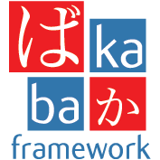

:orphan:

Hai, Perkenalkan Baka framework
===============================

|docs| |python| |pypi| |license|

Selamat datang di Baka framework documentation. Dokumentasi ini terbagi atas bagian yang berbeda. Saya sarankan Anda memulai :ref:`install` dan kemudian menuju ke :ref:`quickstart`. Selain quickstart, ada juga yang lebih detail :ref:`tutorial` itu menunjukkan bagaimana membuat aplikasi lengkap (walaupun kecil) dengan Baka. jika Anda lebih suka menyelam lebih dalam, periksa dokumentasi :ref:`api`. Pola umum dijelaskan di :ref:`patterns`.

Baka bergantung pada beberapa libraries:
`Pyramid`_ untuk core web framework engine dan
`Werkzeug`_ WSGI toolkit untuk development server.
Librari tersebut tidak terdokumentasi disini. Jika ingin mempelajari lebih lanjut, silakan cek halaman link ini:

-   `Pyramid Documentation <https://trypyramid.com>`_
-   `Werkzeug Documentation <http://werkzeug.pocoo.org/docs>`_

.. _Pyramid: https://trypyramid.com/
.. _Werkzeug: http://werkzeug.pocoo.org/

.. include:: contents.rst.inc

.. |license| image:: https://img.shields.io/pypi/l/baka.svg
    :alt: License
    :target: https://pypi.python.org/pypi/baka/0.4.1

.. |pypi| image:: https://img.shields.io/pypi/v/baka.svg
    :alt: Pypi package manager
    :target: https://pypi.python.org/pypi/baka/0.4.1

.. |python| image:: https://img.shields.io/pypi/pyversions/baka.svg
    :alt: Python version
    :target: https://pypi.python.org/pypi/baka/0.4.1

.. |docs| image:: https://readthedocs.org/projects/baka-framework/badge/?version=latest
    :alt: Documentation Status
    :target: https://baka-framework.readthedocs.io/en/latest/?badge=latest